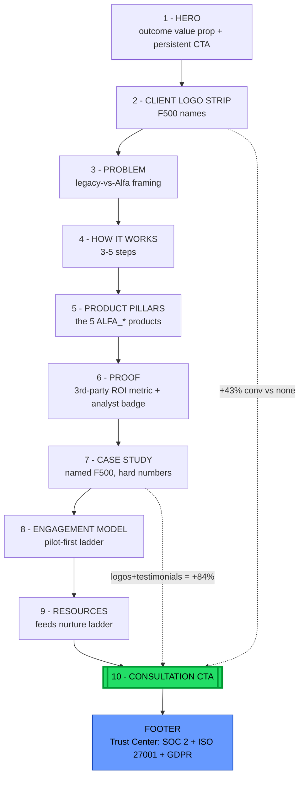
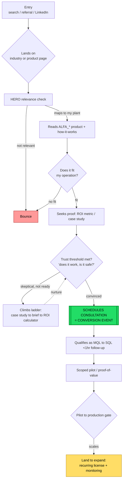

# Alfa ITG — Conversion KPI Document

A definition of success for two things only: **what it takes to convert a
client**, and **what the website must do** in that conversion. Every target is
grounded in research, with the rationale ("why") and source attached so it is
defensible to a stakeholder.

Scope is deliberately narrow. This is not a marketing plan or a brand document —
it is the measurable contract for the deal and the site that feeds it.

---

## 1. Context: the problem the KPIs solve

Alfa ITG sells proprietary Industrial AI to Fortune 500 manufacturers. The
purchase is **$100K–$2M+, bought by a 6–10 person committee, over a 6–18 month
cycle.** There is no cart and no checkout.

Two research facts govern every KPI below:

- **The deal is won in internal alignment you never see.** 74% of B2B buying
  teams show "unhealthy conflict," >40% of deals stall on lack of consensus, and
  ~80% feel post-purchase regret (Gartner). Conversion = de-risking the
  *decision* across the committee, not persuading one buyer.
- **Only ~5% of the market is in-market at any moment** (the 95:5 rule), and
  ~70% of the buying journey is now anonymous ("dark funnel") with 67% of buyers
  preferring a rep-free experience. The website must do the persuading the sales
  rep used to do — and serve the 95% who will only buy later.

**Governing principle:** the website does not sell — it starts a qualified
conversation and arms a champion to win the internal vote. KPIs are therefore
weighted toward **lead quality and stage-progression**, not raw traffic.

---

## 2. Pillar 1 — What is needed to convert a client

> The dominant competitor is *"no decision."* The job is to remove decision risk
> for a fractured committee, not to out-argue a single buyer.

### 2.1 Committee coverage & champion enablement

| # | KPI | Target | Why it matters | Source |
|---|---|---|---|---|
| 1.1 | **Buying-group coverage** — % of 8 stakeholder archetypes engaged per open deal (VP Ops, Plant Mgr, CDO/Head of I4.0, CIO, OT Security, CFO, Procurement, Legal) | ≥ 5 of 8 by stage 2; ≥ 7 before proposal | Deals die when a blocker (usually CFO or OT Security) is discovered *late* | Gartner (6–10 person committee; 74% conflict) |
| 1.2 | **Champion enablement assets delivered** — per-stakeholder one-pagers in the champion's hands (CFO ROI, CISO security, Plant-Mgr workflow) | 100% of stage-3 deals | Buyers are **1.8× more likely to close** when using supplier-provided internal-sell tools | Gartner via Sales & Marketing |
| 1.3 | **Reference activation** — named peer reference (same industry / plant type) before decision | 100% of stage-3 deals | References are the decisive objection-killer; buyers spend months "building internal confidence" | jbyer / Gartner |

### 2.2 Proof & risk-removal (the "yes" unlockers)

| # | KPI | Target | Why it matters | Source |
|---|---|---|---|---|
| 1.4 | **Quantified, sector-matched proof** — case studies with hard before/after metrics, per target industry | ≥ 1 per industry (Auto, Aero, Energy, Life Sci, F&B) | Committees need proof from "someone like me"; relevant case studies lift conversion ~15% | SaaS Hero / Deloitte |
| 1.5 | **Security/compliance pack complete** — SOC 2 + ISO 27001 + GDPR/CCPA + OT-security architecture doc (not "files coming soon") | Published; table-stakes | OT Security / Procurement will **hard-block** without it; 40% of manufacturers report 6–10 breaches/yr | Augury Trust Center; Deloitte 2025 |
| 1.6 | **CFO-grade ROI model** — payback against the client's own hurdle rate | Payback ≤ 18–36 mo; IRR > WACC | CFO won't approve CapEx that can't clear the hurdle rate; enterprise AI EBIT gains often <5% and hard to attribute | EAS / McKinsey |
| 1.7 | **Risk-reversal terms offered** — pilot-first, exit/portability clauses, outcome/shared-savings option | 100% of enterprise deals | Disarms CFO payback fear + Procurement lock-in fear (now a named "liability") | L.E.K.; PYMNTS |

### 2.3 Deal mechanics (the money ladder)

| # | KPI | Target | Why it matters | Source |
|---|---|---|---|---|
| 1.8 | **Pilot/POV designed as a scale-gate** — pre-agreed success metrics + integration plan + expansion path | 100% of pilots | **Only ~4 of 33 industrial AI pilots reach production**; pilot purgatory is the #1 deal-killer | IDC / AI Smart Ventures |
| 1.9 | **Pilot → production conversion rate** | ≥ 40% (vs. ~12% baseline) | The single biggest revenue lever in the business | IDC |
| 1.10 | **Land → expand rate** — single-line deals growing to multi-line/plant or +1 ALFA_* product within 12 mo | ≥ 30% | Recurring revenue (ALFA_MAINTENANCE™ / SAVE™) is the real prize, not one-time projects | Monetizely |
| 1.11 | **Enterprise sales-cycle length** | Track vs. 9–12 mo; flag stalls >270 days | >$500K deals avg ~270 days; 82% include a formal POC (~+2.4 mo) | Forrester; SAP |
| 1.12 | **Win rate (Opportunity → Close)** | 25–39% mid-market / 8–15% true enterprise | Sets realistic pipeline-coverage math | Digital Bloom / Data-Mania |

---

## 3. Pillar 2 — What the website needs to do

> The website's one job: move a skeptical visitor through *real → relevant → it
> works → it's safe → easy first step*, convert them into a **qualified
> consultation request**, and capture the 95% not-ready-today via a graduated
> CTA ladder.

### 3.1 Primary conversion (the north-star)

| # | KPI | Target | Why it matters | Source |
|---|---|---|---|---|
| 2.1 | **Visitor → qualified lead** (demo/consultation request) | **1.5–2.5%** (8–15% = top-tier) | The site's reason to exist; manufacturing/cyber sit at the low end, so set conservatively | Surface Labs / Ruler |
| 2.2 | **In-profile lead rate** — % of leads matching ICP (F500 manufacturer, target industry, right title) | ≥ 50% of leads | Volume is vanity; a committee deal needs the *right* role, not more tire-kickers | research §1 |
| 2.3 | **Speed-to-lead** — form submit → sales follow-up | **< 1 hour** | <1hr → **53% conversion** vs. **17% after 24hr** — highest-ROI operational lever | Data-Mania |

### 3.2 The conversion ladder (serve the 95% not ready today)

| # | KPI (each rung = its own micro-conversion) | Target | Why it matters | Source |
|---|---|---|---|---|
| 2.4 | **Case-study view rate** (no gate, top of ladder) | ≥ 15% of visitors | Lowest-friction trust-builder; feeds lead scoring | research §4 |
| 2.5 | **Gated brief / whitepaper download** | 2–4% | Captures email from the out-of-market 95% | 95:5 rule (Unbound) |
| 2.6 | **ROI / TCO calculator completion** | **65–78%** of those who start | Self-qualifies, builds the champion's business case; leads convert **2–3× higher** | Outgrow / OpGen |
| 2.7 | **Ladder progression rate** — % of nurtured leads advancing one rung | Track MoM | Measures nurture health, not just bottom-of-funnel | research §4 |

> **Design note:** this is exactly where Alfa's current sites fail — they ask for
> contact while Proof and Security sit empty ("Files coming soon"). The ladder
> must exist *and be filled* before the ask earns a click.

### 3.3 Funnel quality (does the site produce *deals*, not just leads)

| # | KPI | Target | Why it matters | Source |
|---|---|---|---|---|
| 2.8 | **Lead → MQL** | ~40% | First quality gate | Digital Bloom |
| 2.9 | **MQL → SQL** | ≥ 39% (best-in-class 60%) | Behavioral lead-scoring drives this — instrument ladder actions as signals | Data-Mania |
| 2.10 | **Web-sourced / influenced pipeline & revenue** | Track $ | Over a 9–12 mo cycle, *influenced revenue* beats monthly lead counts | Demand Gen Report |

### 3.4 On-page mechanics (the free conversion levers)

| # | KPI | Target | Why it matters | Source |
|---|---|---|---|---|
| 2.11 | **Demo-form length / completion** | 3–5 fields, or multi-step (**+86%** conv.) | 3 fields ≈ 23–25% → 10+ ≈ 6.9%; each field past 5 = 20–30% penalty | Foundry CRO |
| 2.12 | **Form abandonment** | < 40% (>50% = broken) | Direct, fixable leak | Orbit |
| 2.13 | **Hero / above-fold conversion** (A/B tested) | Test continuously | ~80% of persuasion happens above the fold; optimized heroes show up to +63% | CorePPC |
| 2.14 | **Bounce rate** | ≤ 40% good; ≥ 60% poor | Relevance signal | Clear Digital |
| 2.15 | **Scroll depth** | Reach proof/CTA sections (>75% scrollers stay 3.4× longer) | Confirms section *ordering* works | Clear Digital |
| 2.16 | **Trust-page reach** — % of in-profile visitors hitting Security/Compliance | Track | OT Security must find it; proxy for deal-readiness | research §3 |

---

## 4. Required site structure (the IA the KPIs assume)

Research converges on one near-universal template (Augury, Cognite, Samsara,
C3 AI, Falkonry all use it). The site **must** be built in this order or the
funnel KPIs above will not fire: two things to hold in your head — **every path
drains to one "Schedule a Consultation" CTA**, and **proof precedes the ask.**

Primary CTA everywhere = **Schedule a Consultation.** Secondary = case study /
ROI calculator. Trust Center in the footer is table-stakes for Fortune 500
buyers, not optional. (Source: competitor-flow synthesis.)

### 4.1 Customer conversion flow

A real buyer — a Head of Industry 4.0 or VP Operations — from arrival to the web
conversion event. Everything after the consultation click is the months-long,
committee-driven cycle the website never sees.

---

## 5. The 7 KPIs that matter most

If this document is reduced to a dashboard, these are the load-bearing metrics:

1. **Visitor → qualified lead ≥ 1.5–2.5%** (2.1) — the site's north-star
2. **In-profile lead rate ≥ 50%** (2.2) — quality over volume
3. **Speed-to-lead < 1 hour** (2.3) — 53% vs 17%, the cheapest win
4. **ROI-calculator completion 65–78%** (2.6) — the self-qualifier that builds the champion's case
5. **MQL → SQL ≥ 39%** (2.9) — does the site produce *deals*
6. **Pilot → production ≥ 40%** (1.9) — biggest revenue lever; beats pilot purgatory
7. **Champion enablement on 100% of stage-3 deals** (1.2) — wins the invisible internal vote

---

## 6. One-line summary

For a committee-bought, long-cycle industrial-AI purchase, **converting a client
means de-risking a fractured committee's decision, and the website's only job is
to turn an anonymous skeptic into a qualified conversation while arming a
champion** — so the KPIs measure lead *quality* and *stage-progression*, never
raw traffic.

---

## 7. Caveats on the benchmarks

Gartner primary pages are gated (figures cited via secondary reporting).
Funnel-stage, CPL, and form benchmarks come from aggregator/vendor sources —
treat as *directional bands*, then recalibrate against Alfa's own baseline once
live. Manufacturing and cybersecurity sit at the **low-conversion, long-cycle**
end of every range, which is why the targets above are set conservatively.

### Primary sources

Gartner (B2B buying journey; buyer-team conflict) · McKinsey (state of AI;
scaling beyond the pilot) · Deloitte 2025 Smart Manufacturing Survey · Forrester
(sales-cycle length; TEI ROI studies) · IDC (pilot-to-production attrition) ·
competitor teardowns: Augury, Cognite, Sight Machine, C3 AI, Samsara, Tulip,
Rockwell, Siemens Xcelerator, Falkonry · CRO/demand-gen benchmarks: Surface
Labs, Ruler Analytics, Data-Mania, Digital Bloom, Foundry CRO, Outgrow, OpGen
Media, Clear Digital, Unbound B2B.
