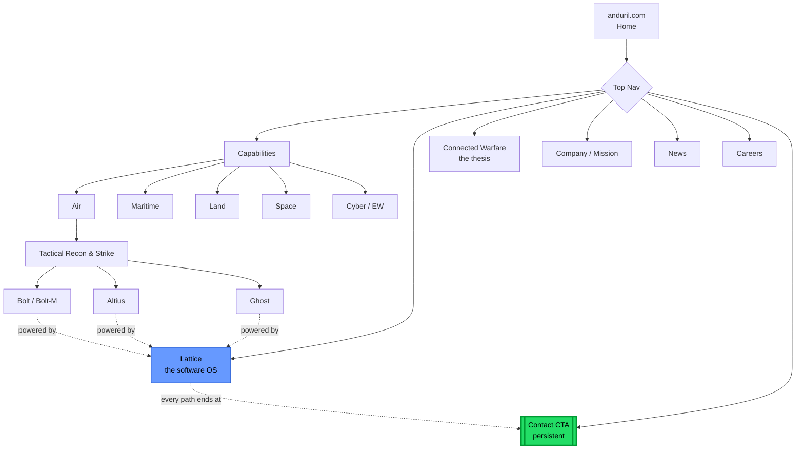
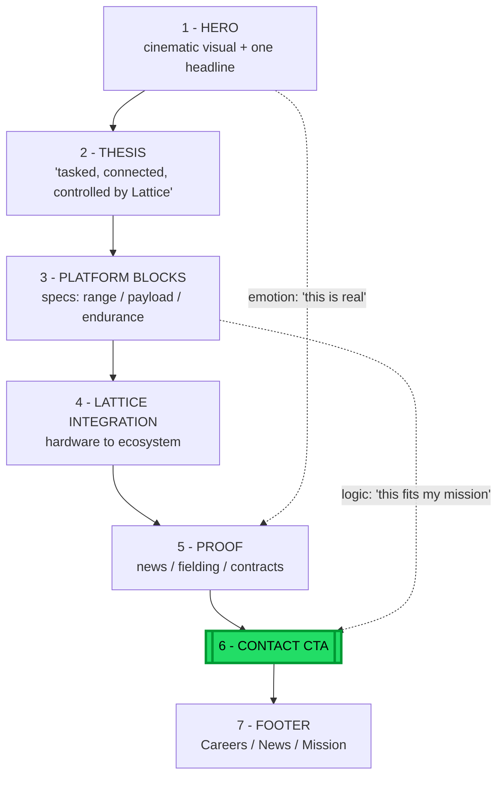
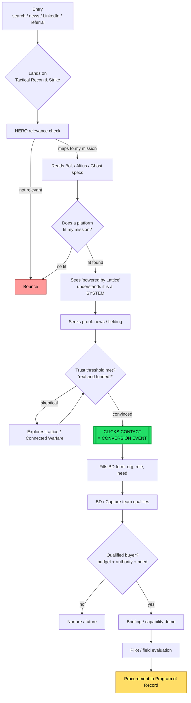

# Anduril Website Design Philosophy

A teardown of the design principles behind anduril.com, the components that
express them, and why each choice wins clients in a B2G (business-to-government)
defense market.

---

## 1. Context: the problem the design solves

Anduril sells to governments, not consumers. There is no cart, no pricing, no
checkout. Procurement runs on classified requirements, OTAs (Other Transaction
Authorities), and programs of record — cycles that take months to years.

The legacy-prime default (Lockheed, Raytheon, GD) signals *"trust us, we're old
and established."* That repels the three audiences Anduril needs most:
- reform-minded DoD insiders who think the primes are slow,
- elite engineers choosing an employer,
- allied governments seeking a modern alternative.

**The design philosophy is a reaction against the stale-prime default.** Its job
is not to sell a product on the page — it is to make Anduril legible as a
*different kind of company*.

---

## 2. The core design principles

### 2.1 Restraint as a confidence signal
Dark, cinematic, heavy whitespace, sparse copy, a single persistent CTA
(`Contact`), no pricing, no clutter.
- **Why it works:** buyers infer engineering rigor from design rigor. Discipline
  on the page implies discipline in the hardware. Loud design reads as
  compensating; restraint reads as conviction.

### 2.2 Show, don't tell
Real footage and renders of *fielded* hardware (Bolt hand-launched, Ghost in the
field), not stock imagery.
- **Why it works:** directly attacks the #1 procurement fear — vaporware. Every
  shot of a real, working system is a trust deposit that pre-answers "is this
  real and funded?" before a human is involved.

### 2.3 Software is the hero; hardware is interchangeable
Relentless "tasked, connected, controlled by **Lattice**." Every product page
drains back to the Lattice software platform.
- **Why it works:** reframes the purchase from "buy a drone" (commodity,
  price-shoppable) to "join an ecosystem" (sticky, premium platform
  relationship). This is the single biggest *commercial* reason the design wins —
  it converts one-off sales into long-term lock-in. The design philosophy mirrors
  the product philosophy: attritable hardware, durable software OS.

### 2.4 Mythic, confident branding
Anduril (the sword from Lord of the Rings), Ghost, Fury, Roadrunner, Lattice,
Bolt.
- **Why it works:** gives the brand a point of view. Signals conviction about the
  future of warfare — which attracts the engineers and DoD reformers Anduril
  recruits and sells to.

---

## 3. Components and how they map to the principles

| Page component | Principle expressed | Funnel job |
|---|---|---|
| Hero (headline + cinematic visual) | Restraint, Show-don't-tell | 5-second relevance check |
| Per-platform spec blocks (range, payload, endurance) | Show-don't-tell | Buyer self-qualifies against mission |
| "Powered by Lattice" cross-links | Software-is-hero | Reframe commodity → ecosystem |
| News / fielding / contract proof | Show-don't-tell | Clear the "is this real?" trust gate |
| Single `Contact` CTA | Restraint | The one conversion event |
| Footer (Careers, News, Mission) | Mythic brand | Secondary paths: talent, press |
| Product taxonomy (Air/Maritime/Land/Space + Lattice) | Software-is-hero | Every path drains toward Lattice + Contact |

---

## 4. Why the philosophy gets clients — the mechanism

The site has **two conversion targets**, and the design serves both at once:

| Audience | What the design does | Conversion |
|---|---|---|
| Government buyers | Lowers perceived risk; reframes drone → system; self-qualifies via specs | `Contact` → BD → pilot → program |
| Elite engineers | Signals "serious tech company, not stale prime" | Job application |

The non-obvious link: **talent is a prerequisite for product, and product wins
contracts.** A site that looks like SpaceX recruits SpaceX-caliber engineers, who
build credible systems, which generate the fielding proof that converts buyers.

This creates a flywheel:

> modern brand → better talent → better product → buyer trust → contracts →
> more brand credibility

**Deepest answer:** in a market where the buyer's career risk is picking a vendor
that under-delivers, *looking like the competent modern choice is itself the
conversion mechanism.* Legacy primes say "trust us, we're old." Anduril's design
says "trust us, we're the future — and here's the working hardware to prove it."

---

## 5. One-line summary

Anduril applies **consumer-tech restraint and "show the real thing" credibility**
to defense, pointed at **software-as-the-hero** — which lowers buyer risk,
reframes commodity hardware into a sticky platform, and recruits the talent that
makes the whole story true.

---

## 6. Website framework at a glance

### 6.1 Site skeleton (information architecture)

Two things to hold in your head: **every product rolls up to Lattice** (software
is the hub), and **every path drains to one Contact CTA** (no other conversion
exists).

### 6.2 Page template (how any product page is stacked)

Top-to-bottom it is a deliberate sequence: **hook → frame as a system → prove
specs → lock into ecosystem → de-risk with proof → convert.** Emotion and logic
are interleaved so both the gut ("looks real") and the analyst ("specs fit") say
yes before the buyer hits Contact.

### 6.3 Customer conversion flow

A real buyer — a DoD program manager or allied procurement officer — from arrival
to conversion. The web conversion event is the `Contact` click; everything after
is a months-long government cycle the website never sees.

