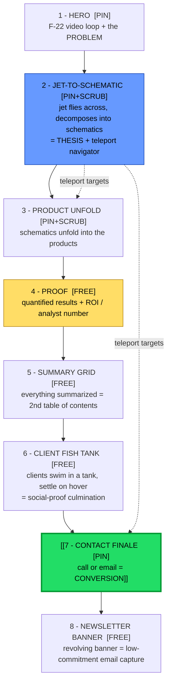

# Alfa ITG — Cinematic Scroll Taster PRD (Desktop)

A product requirements document for a **single-page, scroll-driven experience
prototype** — a "taster" built to pitch a prospective client on what their
industrial-AI site *could feel like*. It is an experience artifact, not the
production site.

Two sibling docs govern the strategy this experience serves and should be read
alongside it:
- `anduril-design-philosophy.md` — the aesthetic/credibility north star
  (restraint, show-don't-tell, cinematic, single persistent CTA).
- `alfa-itg-conversion-kpis.md` — the canonical IA and conversion contract
  (proof-precedes-ask, every path drains to one CTA).

Where this taster simplifies or reorders that canonical IA, it does so
deliberately to sell the *experience*; the production build reconciles back to
those two docs.

---

## 1. Context: what this taster is for

- **Audience:** a single prospective client (a company Ray expects to work
  with), watching a pitch. Not public traffic.
- **Job:** demonstrate craft and a point of view — prove "we can make something
  that feels like *this*." Smoothness and the two showpiece transitions carry
  the entire pitch.
- **Conversion goal:** a **call or email**. Low-commitment; one persistent door.
- **Platform:** **desktop only.** Mobile is explicitly out of scope here and
  lives in a separate PRD (straight vertical scroll, simple transitions, no
  heavy animation). This document is the reference that mobile PRD points back
  to.

**Governing principle for the taster specifically:** *front-load spectacle,
then release the brakes.* The opening is allowed to be slow and breathtaking;
everything after products is fast and scannable so a sold viewer can move.

---

## 2. Interaction model (the core mechanic)

The page behaves like a **slideshow, not a free-scroll document** — but it never
traps the user.

- **Snap points** — the page rests at each content section ("slides").
- **Scrubbed transitions** — the animation lives *between* slides and is tied to
  scroll position. Scroll gently → the animation plays out and is savored.
  Scroll hard → you fast-forward through it to the next snap, like blitzing a
  slideshow.
- **The inviolable rule:** *scroll always maps to progress.* The user is never
  frozen waiting for an animation to finish. This is scroll-**linked** snapping,
  not scroll-**locking**.

Rhythm across the page: **SNAP (rest on content) → SCRUB (animated transition) →
SNAP → SCRUB …** Each section below is tagged `[REST]` or `[SCRUB]`.

> Implementation note: scrubbed transitions tie an animation timeline to scroll
> position; snap behavior settles the viewport to the nearest section boundary
> on scroll-end. Do not block scroll input during a transition.

---

## 3. Schema description (the scroll skeleton)

Ordered beats, top to bottom. Each is a snap target and a progress-bar segment.

> `[PIN]` / `[PIN+SCRUB]` = spectacle, scroll-locked set-pieces. `[FREE]` =
> free-scroll, read/scan beats. The rule and the per-beat tempo live in
> `cinematic-taster-tempo.md`; this section is the *what*, that doc is the
> *rhythm*. Spectacle is pinned; proof and navigation are free-scroll —
> pinning everything tanks bounce/scroll-depth.

### Beat 1 — Hero `[PIN]`
- Full-bleed **F-22 video loop** background.
- States **the problem** Alfa ITG exists to solve; establishes "industrial AI
  company" in one headline.
- Must pass a 5-second relevance check on its own.
- Persistent header CTA present from here (see §4.2).

### Beat 2 — Jet → Schematic `[PIN+SCRUB]` *(showpiece #1)*
- On scroll, the jet **flies across the screen and decomposes into its
  schematics**. This is the signature moment — it must be buttery.
- The schematic carries the **company thesis** (the "why we exist" frame).
- **Doubles as a navigator:** schematic components are **clickable teleport
  targets** that jump to points on the page (products, contact). This is the
  non-linear escape hatch — a ready buyer skips the film and jumps straight to
  what they need.

### Beat 3 — Product Unfold `[PIN+SCRUB]` *(showpiece #2)*
- The schematic **unfolds** to reveal the products — each component opening into
  a product, one beat per ALFA_* product. Scrubbed, rhythmic reveals.
- Pacing changes after this: brakes off. The following beats are free-scroll and
  scannable.

### Beat 4 — Proof `[FREE]`
- A **dedicated results beat** with a **hard, quantified number** (genre
  standard: a Forrester-style "310% ROI" / "40% downtime cut" line) plus an
  analyst/ROI signal.
- **Why it's its own beat:** proof must *precede* the ask (KPI doc 1.4, "proof
  precedes the ask"). Social proof previously lived only inside hover-hidden
  client logos — that hides the strongest asset. This beat makes it visible and
  unmissable before Contact.
- Free-scroll so the committee's CFO / OT-security reader can actually read it.

### Beat 5 — Summary Grid `[FREE]`
- Everything resolves into a **grid that summarizes the products** — a **second
  table of contents** / recap. "Here's everything; pick anything."
- Distinct in feel from the Beat-2 schematic: the schematic is the *cinematic
  exploratory map* ("discover"); the grid is the *fast utility index* ("I know
  what I want, take me there"). Keep them visually different so it doesn't read
  as "didn't I just see this?"

### Beat 6 — Client Fish Tank `[FREE]`
- The client logos live in a **fish tank**: a contained aquarium-style space the
  clients **swim around in like fish**. The tank **fills its space as you arrive
  at this section** (the social-proof culmination — it "captures everything"),
  sitting just before the Contact finale.
- Hover a fish → it **settles/pauses** and reveals that client's services, so a
  drifting logo becomes a stationary, readable, clickable target. Drift resumes
  on mouse-out.
- This is the *delight* form of social proof; the hard numbers live in Beat 4 so
  proof is never hidden behind a hover. (Mobile PRD: convert the tank to a simple
  tappable logo grid — no hover on touch.)

### Beat 7 — Contact Finale `[PIN]`
- The dramatic close: everything converges to **one CTA**.
- The **conversion event: a call or email.** Keep the ask low-friction.
- The *showpiece* door — but not the *only* one. The persistent header/corner
  CTA and schematic teleport let a viewer convert earlier (§4.2).

### Beat 8 — Newsletter Banner `[FREE]` *(footer)*
- At the very bottom, a **revolving/rotating banner** for **newsletter signup** —
  a low-commitment **email capture**.
- **Why:** catches the ~95% who aren't ready to talk today (KPI doc §3.2, the
  conversion ladder / 95:5 rule). Contact is the high-intent ask; the newsletter
  banner is the lower rung that keeps the out-of-market visitor reachable.

---

## 4. Auxiliary features (the subtleties to hold in mind)

The minute things that make it feel intentional rather than flashy.

### 4.1 Progress indicator + skip navigation — "subconscious length cue"
- **Thin, translucent white vertical bars**, one segment per section, fixed to a
  screen edge and vertically centered.
- The **active segment lights up**; others sit at low opacity. Gives a
  *subconscious* sense of how long the page is and where you are.
- **Make segments clickable** → a second teleport layer alongside the schematic
  map. Low effort, high payoff.
- **Skip arrows between the stacked bars.** A small arrow sits between segments
  and **jumps to the next section** — so the progress bar doubles as the
  skip-intro affordance. Crucially, the arrow is present **from the hero
  onward**, so a repeat visitor or serious buyer who doesn't want the show can
  bail out of the cinematic opening immediately ("Skip intro / Go to products")
  rather than having to scroll into it first.
- Subtle by default; brighten the active one, faint hover-grow at most. The
  arrows can sit near-invisible until hover/proximity so they don't clutter the
  cinematic frame.

### 4.2 Header behavior + persistent CTA
- Header **hides on scroll-down, reappears on scroll-up.** Scroll-up is a
  "reconsider / go back" gesture — so the **Contact CTA reappears at the exact
  moment of hesitation.**
- **Always-visible persistent Contact.** Beyond the header, pin a small,
  unobtrusive **"Contact" button in a corner that stays visible the whole way
  down** once the viewer passes the hero. Same single ask — just always
  reachable, so a viewer sold at Beat 2 never has to scroll to the bottom to
  act. The dramatic Beat 6 close remains the *showpiece* door; this is the
  ambient one. Both fire the same conversion event (call/email).

### 4.3 Schematic-navigator affordances (discoverability)
- Users won't know schematic parts are clickable unless signaled. Provide subtle
  cues: **hover glow, cursor change, a faint "explore the schematic" hint** on
  first reveal.
- The schematic map should be **recallable** — a small persistent way to reopen
  it from anywhere, so it's a standing navigation layer, not a one-time moment
  scrolled past.

### 4.4 Subtle hints, generally
- Lean on **quiet, ambient cues** over loud instructions — micro-motion,
  opacity, a single hint that fades. Consistent with the Anduril
  restraint-as-confidence principle.

### 4.5 Motion, performance & polish
- **One janky frame undoes the pitch.** Transition smoothness is the top
  non-negotiable.
- Background video: **compressed loop, poster fallback, lazy-load** below-fold
  assets so the hero never stutters.
- Honor **`prefers-reduced-motion`**: serve a calmer, low-motion variant for
  viewers (or machines) that ask for it. Protects the demo on a mid-tier laptop.

### 4.6 Tone & aesthetic guardrails
- Dark, cinematic, heavy whitespace, sparse copy — inherit the Anduril
  philosophy. Restraint reads as engineering conviction; clutter reads as
  compensating.

---

## 5. Out of scope (for this PRD)

- **Mobile / responsive** — separate PRD; straight vertical scroll, simple
  transitions, no heavy animation.
- **Real content/copy** — placeholder or representative content is acceptable;
  the taster sells the experience, not the words.
- **The full canonical IA & conversion ladder** — beyond the single Proof beat
  (Beat 4) and the newsletter rung (Beat 8) included here, the complete ladder
  (case studies, ROI calculator, Trust Center, multi-rung nurture) lives in
  `alfa-itg-conversion-kpis.md`
  and the production build, not this experience prototype.

---

## 6. Open questions

1. **F-22 metaphor — literal or aspirational?** A military jet fits a
   defense/aerospace buyer perfectly; for broader manufacturing it reads as a
   "precision engineering" vibe. Confirm it matches the prospective client's
   sector before committing the asset.
2. **Exact conversion mechanic** — calendar embed for the call vs. a short form
   vs. a plain mailto? Affects how the Beat 6 close is built.
3. **How many products** unfold from the schematic (drives Beat 3/4 layout)?

---

## 7. One-line summary

A **desktop-only, slideshow-paced cinematic taster** — F-22 hero stating the
problem, a scrubbed jet-to-schematic transition that doubles as a teleport
navigator, products unfolding into a summary grid, a floating client bubble, and
a single low-friction **call/email** close — built to **front-load spectacle
then release the brakes**, with quiet auxiliary cues (translucent progress bars,
hide-on-down header, schematic affordances) doing the wayfinding so the
experience feels intentional, not flashy.
