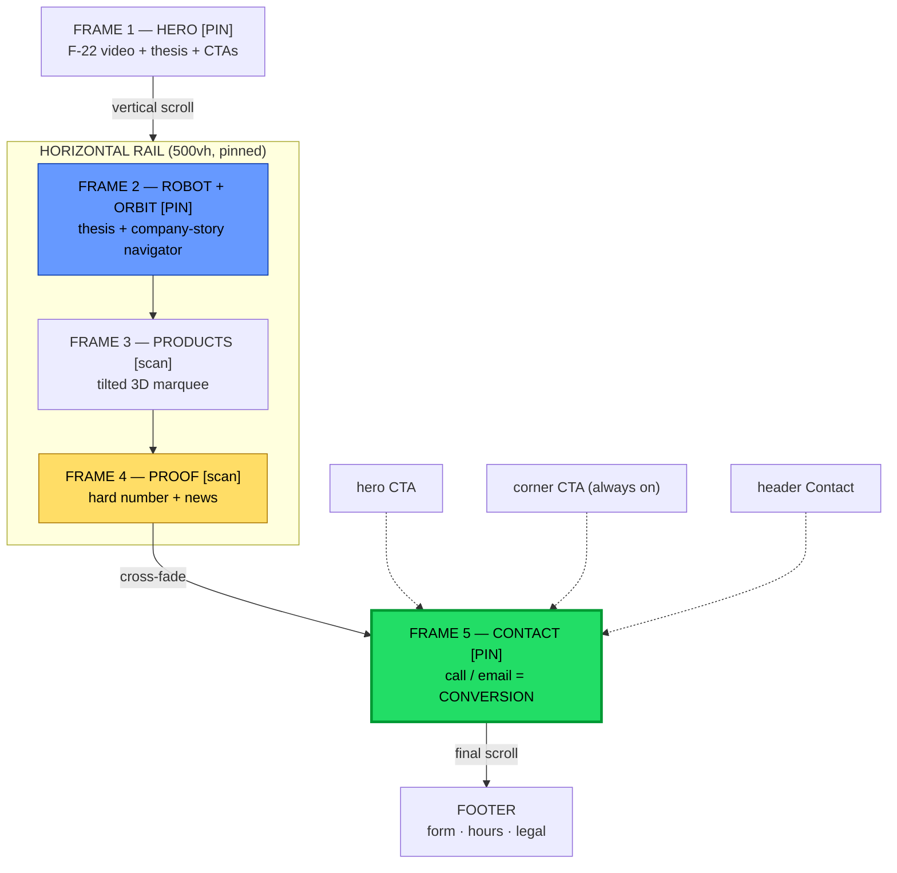

# Alfa ITG — Splash Site Design Philosophy

A teardown of the design principles behind the `prototype/splash/` cinematic
taster, the components that express them, and **why each authorial choice was
made in the way it was** — read against the two documents that govern it:

- `anduril-design-philosophy.md` — the **aesthetic / credibility** north star
  (restraint, show-don't-tell, single persistent CTA).
- `alfa-itg-conversion-kpis.md` — the **conversion contract** (proof precedes the
  ask; every path drains to one CTA; serve the 95% not ready today).
- `cinematic-taster-prd.md` — the **experience spec** this build implements
  (slideshow pacing, front-load spectacle then release the brakes).

This doc explains the *as-built* site, which diverges from the PRD in a few
deliberate places (§6). Where it does, the reasoning is given.

---

## 1. Context: the problem this design solves

The splash is a **taster**, not the production site. Its audience is a *single
prospective client* watching a pitch, and its job is to prove one thing: **"we
can make something that feels like this."** The conversion goal is deliberately
low — a **call or email** — because the taster sells *craft and a point of view*,
not the full conversion funnel.

That reframes every choice. The KPI doc establishes that an Alfa-type sale is
**committee-bought, $100K–$2M+, 6–18 months**, won by *de-risking a skeptical
committee's decision*. A buyer's dominant fear is picking a vendor that
under-delivers. So — exactly as in the Anduril teardown — **looking like the
competent, modern, disciplined choice is itself the conversion mechanism.** A
janky frame doesn't just look bad; it reads as "their engineering is sloppy too."
This is why the prototype's single non-negotiable is *motion smoothness*.

**Governing principle (inherited from the PRD):** front-load spectacle, then
release the brakes. The opening earns the right to be slow and breathtaking;
everything after the products is fast and scannable so a sold viewer can move.

---

## 2. The three inherited north stars

| Source doc | What the splash takes from it | Where you see it |
|---|---|---|
| **Anduril philosophy** | Restraint as confidence; show the real thing; one persistent CTA; mythic/cinematic tone | Dark UI, F-22 footage, real Spline robot, single call/email ask |
| **Conversion KPIs** | Proof precedes the ask; every path drains to one CTA; a lower rung for the 95% | Dedicated Proof beat before Contact; 3 redundant doors to Contact; footer form + corner CTA |
| **Taster PRD** | Slideshow pacing that never traps; spectacle-then-scan; quiet wayfinding | The notched scroll engine; pinned hero/robot → free-scroll products/proof; progress bar + skip arrows |

---

## 3. Core design principles (as built) — and why

### 3.1 A slideshow that never traps you — the "notch/beat" scroll engine
`lib/frameScroll.ts` is a custom wheel/touch-hijacked **velocity model**. You
dead-stop on each frame's notch; to leave, a new push must beat the speed you
stopped at by 5% *and* arrive after a 0.3s hold. OS momentum tails (which only
ever decay) get swallowed, so you rest cleanly on a beat instead of drifting past
it.

- **Why built this way:** the PRD demanded "slideshow, not free-scroll document —
  but never frozen." Native CSS scroll-snap couldn't give the *savor-or-blitz*
  feel (scroll gently → linger; flick hard → advance). The engine makes every
  section a deliberate **beat**, which matches how a committee consumes a
  pitch — one considered idea at a time.
- **The critical authorial restraint:** under `prefers-reduced-motion` the engine
  **drops the hijack entirely** and restores native scroll (keyboard frame-jump
  still works). This honors the PRD's accessibility rule *and* protects the demo
  on a mid-tier laptop — a dropped-frame pitch is a lost pitch. Scroll *always*
  maps to progress; the user is never blocked waiting on an animation.

### 3.2 Front-load spectacle, then release the brakes
The **Hero** (Frame 1) and **Robot/Transition** (Frame 2) are pinned, cinematic
set-pieces. After them, **Products** and **Proof** ride a free-sliding rail and
read fast.
- **Why:** spectacle earns attention; once earned, a serious buyer (CFO,
  OT-security) needs to *read*, not be performed at. Pinning everything would tank
  scroll-depth (KPI 2.15). Spectacle is pinned; proof and navigation are
  free-scroll.

### 3.3 Show, don't tell (and restraint as confidence)
Real F-22 footage, a real cursor-tracking 3D robot, dark UI, heavy whitespace,
sparse copy — inherited wholesale from Anduril §2.1–2.2.
- **Why:** every shot of a real, working machine is a trust deposit that
  pre-answers "is this real?" before a human is involved. Loud design reads as
  compensating; restraint reads as engineering conviction.

### 3.4 One ask, many doors
There is exactly one conversion event — **a call or email to `IR@alfaitg.com`** —
reachable from four places: the hero CTA, the always-on **corner CTA** (appears
past 80% of the first viewport), the **header Contact** button, and the **Contact
finale**. The footer adds a real (mailto-backed) form as the structured
alternative.
- **Why:** "every path drains to one CTA" (Anduril + KPI §4). The redundancy is
  the point — a viewer *sold at Frame 2* must not have to scroll to the bottom to
  act. The dramatic finale is the *showpiece* door; the corner CTA is the
  *ambient* one. Both fire the same low-friction ask.

### 3.5 Quiet wayfinding over loud instruction
The right-edge **progress bar** (one segment per beat, active segment grows) with
**skip arrows (▾)** between segments; the header that **hides on scroll-down and
returns on scroll-up**; the orbit nodes that glow on hover.
- **Why:** the progress bar is a *subconscious length cue* — it tells a viewer how
  much pitch remains without a word. Scroll-up is a "reconsider" gesture, so the
  header (and its Contact button) **reappears at the exact moment of hesitation**.
  The skip arrows are present from the hero onward so a repeat visitor can bail
  out of the cinematic opening immediately. Consistent with Anduril
  restraint — ambient cues, never a tutorial.

### 3.6 Proof gets its own beat, before the ask
**Frame 4 (Proof)** sits immediately before Contact, with a hard number rendered
in morphing "gooey" text plus a news/testimonial carousel.
- **Why:** KPI 1.4 / §3.2 — *proof must precede the ask*, and the KPI doc's
  sharpest critique of Alfa's live sites is that they request contact while proof
  sits in "files coming soon." Giving proof a dedicated, unmissable beat (not a
  hover-hidden logo) directly corrects that failure mode.

### 3.7 Honest placeholders
The ROI figure ("310% ROI") is **labeled on-screen as illustrative**, and the
contact form is honest that it opens a mail client rather than posting to a fake
backend.
- **Why:** a taster that fakes audited numbers would undercut the very
  credibility it's built to project — and would violate the KPI doc's standard
  (1.4/1.5: proof must be *real* and sector-matched). The structural slot for
  proof is built; production swaps in audited figures.

---

## 4. Components → principle → client need

| Component (file) | Principle expressed | Client-need / KPI it serves |
|---|---|---|
| `frameScroll.ts` notched engine | Slideshow-never-traps; reduced-motion safe | Committee consumes one idea per beat; demo survives weak hardware (2.13/2.15) |
| `HeroSection` — F-22 scroll-expand video | Show-don't-tell; front-load spectacle | 5-second relevance check; "this is real" (hero conv. 2.13) |
| `TransitionSection` — Spline robot + radial orbit | Show real machine; schematic-as-navigator | Thesis ("the company behind the machine") + explorable company story = the *navigator* beat |
| `ProductsSection` — tilted 3D marquee | Restraint, brakes-off scan | "Our Key Offerings" surveyed fast |
| `ProofPanel` — gooey number + news | Proof precedes the ask | The trust gate before Contact (1.4) |
| Contact cross-fade + ink-reveal (`HorizontalRail`) | One low-friction ask | The conversion event: call/email (2.1) |
| Footer form (mailto, a11y labels) | One ask, structured alternative | Lower-friction lead capture; honest no-backend note |
| Corner CTA + header (`App.tsx`) | One ask, many doors; return-on-hesitation | Sold-early viewer converts without scrolling (every-path-drains §4) |
| Progress bar + skip arrows | Quiet wayfinding; non-linear escape | Length cue + teleport layer (PRD §4.1) |
| `LogoBanner` curved-arc marquee | Show-don't-tell social proof | Credibility transfer from named brands (logos +43%, KPI §4) |
| `SplashBackground` pixel field | Restraint, cohesion | Cinematic frame that never competes with content |

---

## 5. The as-built flow, mapped to the buyer

Read against the KPI conversion flow: Hero = relevance check → Robot/Products =
"what is this, does it fit" → Proof = "does it work" → Contact = the web
conversion event. Everything after the call/email is the months-long committee
cycle the site never sees.

---

## 6. Where the taster deliberately diverges from canon — and why

The taster simplifies or reinterprets the strategy docs *on purpose*; it sells
the experience, and the production build reconciles back.

| Canon (PRD / KPI) | As-built choice | Why the divergence is intentional |
|---|---|---|
| "Jet flies across, decomposes into **schematics** that unfold into products" | A **cursor-tracking robot ringed by a radial orbit** of the company story; products are a *separate* marquee | A literal jet-unfold is brittle and asset-heavy; a live, reactive robot delivers the same "real machine" awe with stronger interactivity, and the orbit becomes the company-story *navigator* the PRD wanted. The decomposition metaphor is softened to ship something buttery. |
| "Client **fish tank** — logos swim, settle on hover" | A **curved-arc logo marquee** (monochrome → brand-color on hover) | Same social-proof job, far cheaper to make smooth. The fish-tank delight is deferred; the marquee never risks a janky frame. |
| Proof must be **real, audited, sector-matched** (KPI 1.4) | An **illustrative** "310% ROI" + the live site's own claims ("Since 1990," "ITAR Registered") as placeholder copy | The taster sells *words later, experience now* (PRD §5). It reuses the client's existing copy as scaffolding — but every soft claim is labeled illustrative so it can't be mistaken for verified proof. **Production must replace these with audited, sourced figures**, or it re-creates the exact credibility gap the KPI doc flags in Alfa's real sites. |
| Full conversion **ladder** (case studies, ROI calculator, Trust Center, multi-rung nurture) | Only the **Proof beat** + a footer form | A taster shows the *spine*; the full ladder lives in the production build and `alfa-itg-conversion-kpis.md`. |
| Public, multi-audience, responsive | **Desktop-only**, single-viewer pitch | Mobile is a separate PRD; concentrating effort on two showpiece transitions is what wins *this* pitch. |

> **The one tension worth stating plainly:** the prototype currently echoes the
> very claims the KPI analysis was skeptical of ("Since 1990," ITAR, "Fortune 500
> partners"). That is acceptable *as labeled placeholder* in an experience demo —
> but it is the first thing to fix before this becomes anything a real buyer
> reads. Craft is built; substance is the production team's to supply.

---

## 7. Why the philosophy gets the client — the mechanism

The deepest line from the Anduril teardown applies directly: in a market where
the buyer's career risk is choosing a vendor that under-delivers, *a site that
looks demonstrably more competent than the competition is itself the
de-risking argument.* The notched scroll, the reactive robot, the
frame-perfect transitions, the quiet wayfinding — none of these are decoration.
They are a **proof-by-craft**: if the pitch artifact is this disciplined, the
engineering behind the product plausibly is too.

For a taster pitched to one prospective client, that is the whole game:

> flawless craft → "these people are serious" → trust → the call/email →
> the engagement the website never sees.

---

## 8. One-line summary

The splash applies **Anduril restraint and show-the-real-thing credibility** to a
**slideshow-paced, never-trapped** scroll engine — front-loading two spectacle
beats (F-22 hero, reactive robot) then releasing into fast, scannable Products
and a proof-before-the-ask beat, with one low-friction call/email ask reachable
from everywhere — so that **the craft of the experience is itself the argument**
that de-risks a skeptical committee's decision, exactly as the conversion KPIs
require.
